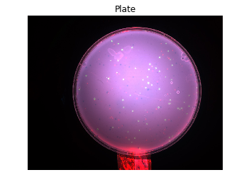
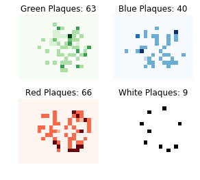

# Automated Phage Counting
Counting phages by detecting plaques using image classification.

``segmentation.ipynb`` segments an image of a plate into smaller images.

``classification.ipynb`` classifies images according to the number of plaques.

``count.ipynb`` counts total plaques in an image based of trained models.

### Input:

### Output:

Based on the [fastai](https://docs.fast.ai/) library.
